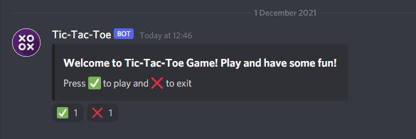
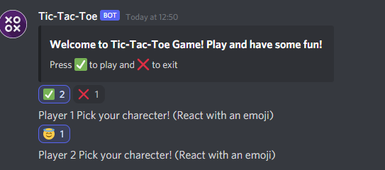
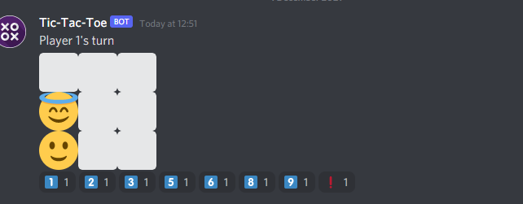

# Tic-Tac-Toe Game Bot in Discord made with Python

This bot has the following features.

1. Use "!clear 'all' or 'number' " command to clear messages
2. Use !game command to play the Tic-Tac-Toe Game, you can choose your custom emojis and play with your friends in the discord server.

## Some screenshots of Gameplay:

